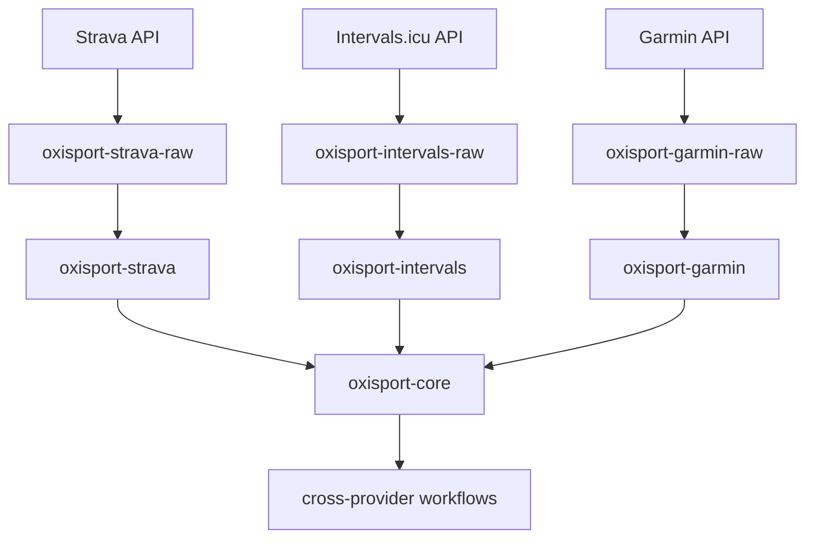
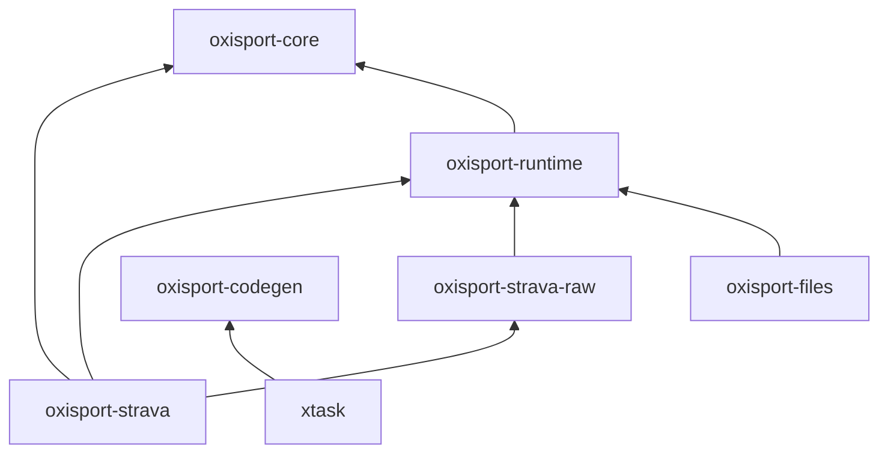

# Architecture

## Layered model

Every remote service integration is split into three layers:

    remote service
          |
          v
    provider raw client   (wire format, provider-specific HTTP)
          |
          v
    provider adapter      (auth, mapping, capability impls)
          |
          v
    oxisport-core         (normalized domain model)
          |
          v
    cross-provider workflows (future)

- `*-raw` crates mirror the remote wire API: request/response types, query and
  path parameter structures, endpoint methods. They do not normalize anything.
- Provider crates implement authentication, capability traits and the
  conversion between raw models and `oxisport-core` types. They also expose
  provider-specific ergonomic APIs and optional access to the raw client:

      strava.raw().segment_efforts(...)

- `oxisport-core` is the normalized model: the meaningful intersection of
  concepts across services (activity, route, workout, athlete, gear, device).

## Dependency graph

- `oxisport-core` never depends on a provider crate.
- `oxisport-runtime` never depends on a provider crate.
- Provider crates never depend on other provider crates; cross-provider
  logic belongs in workflow crates above the provider boundary.

## Capability-based design

There is no giant `Provider` trait. Abstractions are capabilities:

- ActivitySource / ActivitySink
- RouteSource / RouteSink
- WorkoutSource / WorkoutSink
- AthleteSource
- GearSource
- DeviceSource
- DeviceCourseSink

A provider implements only the capabilities it actually supports. Strava and
Garmin both implement `ActivitySource`, but Strava never pretends to be Garmin
and vice versa. Providers are not forced into identical feature sets.

Pagination-heavy capabilities are designed around async `Stream` APIs rather
than requiring providers to collect every page into a `Vec`.

## Async / Tokio policy

All network-facing APIs are asynchronous and Tokio-native.

- no `reqwest::blocking`;
- no blocking sleeps in async code;
- no Tokio runtime created inside library crates — applications own the
  runtime;
- network-facing traits are `Send + Sync` friendly.

## Streaming policy

Large payloads (GPX, FIT, TCX, photos, original activity files) are handled
streaming-first in `oxisport-runtime`:

- `UploadBody` — accepts `Bytes`, a filesystem path, or an async byte stream,
  without forcing whole-file buffering;
- `DownloadStream` — exposes the response as an async byte stream with
  metadata (`ContentLength`, `MediaType`);
- retryable uploads may spool to a temporary file when necessary (future).

The goal is flows like "download from Garmin, upload to Strava" without
buffering the complete object in memory when both sides permit streaming.

## Code generation boundary

Code generation targets raw provider APIs only:

    official OpenAPI --------\
    community/schema ---------> normalized codegen IR -> Rust raw client
    OxiSport custom YAML -----/

Generated code:

- wire request types;
- wire response types;
- query/path parameter structures;
- endpoint methods;
- serialization glue.

Generated sources are committed to git. Code generation never runs in
`build.rs`, so building a provider crate never requires the code generator.
Generated files are marked `// @generated by oxisport-codegen. Do not edit manually.`

Codegen does NOT generate `oxisport-core` domain types, capability
implementations, or cross-provider workflows. Handwritten adapters convert
raw models into the normalized model.

## When something belongs in oxisport-core

A candidate for the normalized model must satisfy all of:

1. the concept is meaningfully shared by at least one implemented provider;
2. the field/shape is not merely a single provider's quirk;
3. the change is justified by a concrete cross-provider need.

When uncertain, keep data provider-specific.

## Future cross-provider workflow layer

Workflow crates sit above the provider boundary and combine capabilities,
e.g.:

    copy activity Garmin -> Strava
    copy route RideWithGPS -> Garmin
    copy workout Intervals -> Garmin

Lossless/native transfer is preferred: when the source provides an original
FIT file and the destination accepts FIT, transfer the original rather than
re-encoding.
